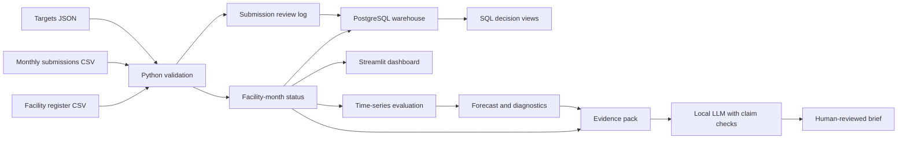

# Architecture and delivery design

This portfolio uses fictional, facility-level aggregate data. It does not
contain patient records or claims about actual Nigerian facilities.

The data sources have different grains. A facility register has one row per
facility; targets have one row per facility and month; reports have one row
per submission, so resubmissions are possible. The validator converts them
into a clean facility-month table and an audit table. A missing submission
creates a facility-month row with blank delivered doses. A submitted zero
remains the numeric value zero.

PostgreSQL is the intended warehouse. `sql/schema.sql` defines a facility
dimension, a facility-month fact table, and the raw-review audit table.
`src/load_postgres.py` loads the project schema in one transaction. It replaces
only tables in the `portfolio_health` schema; if loading fails, PostgreSQL
rolls the transaction back. Views expose monthly performance, follow-up
actions, and lagged facility trends. GitHub Actions starts a temporary
PostgreSQL service and checks these tables and views.

The Streamlit dashboard works directly from versioned CSV outputs, so it can
be demonstrated without a database server on the user's laptop. The Power BI
build kit uses the same processed output and metrics. Power BI Desktop was
not installed in the development environment, so a native Power BI file has
not been generated or tested.

For a cloud design, the same pipeline could land controlled source files in
Azure Blob Storage, execute scheduled validation in an Azure container job,
store approved facts in Azure Database for PostgreSQL, and refresh Power BI
from the database. CI would promote code after tests; source data and database
credentials would remain outside Git. This is a proposed architecture, not
an existing deployment.

The pipeline's boundary is deliberate: it does not infer unique children,
vaccination coverage, medical outcomes, or latent vaccine demand from counts
of delivered doses. Those require other data and definitions.
